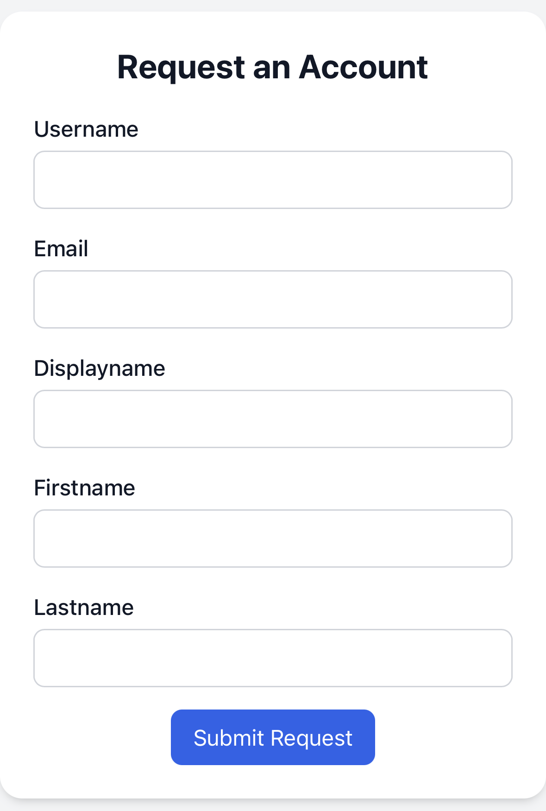
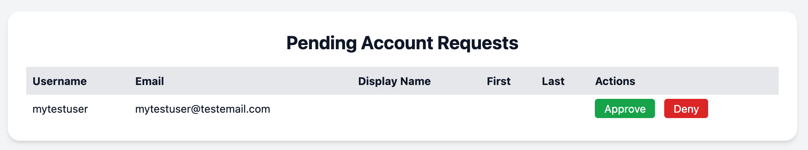

# lldap-request

A working, but simple web tool to request new [lldap](https://github.com/lldap/lldap) accounts with an admin page to approve or deny these requests.

When approved, it creates the account in lldap, adds it to a group if one is defined, and triggers a reset password link to email the user to reset (aka. setup) their password.

It uses [lldap-cli](https://github.com/Zepmann/lldap-cli) in the docker container to interface with lldap.

## Docker Environment Variables

| Name | Required | Default | Description |
| --- | :---: | --- | --- |
| RESET_TYPE | | lldap | What to send the reset password email from. Email must be set up and reset password enabled in the selected application. Options: `lldap`, `authelia` |
| LLDAP_URL | X | | e.g. <https://lldap.domain.com><br />Required if RESET_TYPE is lldap |
| AUTHELIA_URL | X |  | e.g. <https://auth.domain.com><br />Required if RESET_TYPE is authelia |
| LLDAP_USERNAME | X |  | lldap user with account-creation rights |
| LLDAP_PASSWORD | X |  | Password for the above user |
| LLDAP_CONFIG |  | /app/data/lldap_config.toml | Location (in the container) & name of the lldap config file<br />Ensure the volume mount also aligns with this |
| LLDAP_HTTPURL |  | <http://lldap:17170> | Internal, base address of lldap |
| LLDAP_USER_GROUP |  |  | Group to add new users to (if set) |
| DEBUG |  | false | Show debug logging if `true` |

### Example docker-compose.yml

* Request account: http://IP:5005
* Admin: http://IP:5005/admin

```yaml
services:
  lldap-request:
    image: ghcr.io/snuffy2/lldap-request:latest
    #image: ghcr.io/snuffy2/lldap-request:edge
    container_name: lldap-request
    hostname: lldap-request
    restart: unless-stopped
    ports:
      - "5005:5000"
    volumes:
      - ./database:/app/database
      - ./lldap_data:/app/data  # Your local lldap config path
    environment:
      LLDAP_URL: https://lldap.domain.com
      LLDAP_USERNAME: admin
      LLDAP_PASSWORD: changeme
```

This does not handle any kind of security or authentication itself. Instead, it relies on something external to control access. In the example below, it uses Authelia and Traefik. Traefik restricts the new user request to only load from internal IPs. The admin page requires Authelia approval and that address (lldap-request.domain.com) is restricted to the admin group.

### Example docker-compose-traefik.yml

* Request account: https://lldap-request.domain.com
* Admin: https://lldap-request.domain.com/admin

```yaml
services:
  lldap-request:
    image: ghcr.io/snuffy2/lldap-request:latest
    #image: ghcr.io/snuffy2/lldap-request:edge
    container_name: lldap-request
    hostname: lldap-request
    restart: unless-stopped
    volumes:
      - ./database:/app/database
      - ./lldap_data:/app/data  # Your local lldap config path
    environment:
      RESET_TYPE: authelia
      AUTHELIA_URL: https://auth.domain.com
      LLDAP_USERNAME: admin
      LLDAP_PASSWORD: changeme
      LLDAP_USER_GROUP: authelia_users
      DEBUG: 'true'
    labels:
      - traefik.enable=true
      - 'traefik.http.routers.lldap-request-admin.rule=Host(`lldap-request.domain.com`) && Path(`/admin`)'
      - traefik.http.routers.lldap-request-admin.entrypoints=websecure
      - traefik.http.routers.lldap-request-admin.middlewares=chain-authelia@file
      - traefik.http.routers.lldap-request-admin.service=lldap-request
      - 'traefik.http.routers.lldap-request.rule=Host(`lldap-request.domain.com`)'
      - traefik.http.routers.lldap-request.entrypoints=websecure
      - traefik.http.routers.lldap-request.middlewares=middlewares-local-only-whitelist@file
      - traefik.http.routers.lldap-request.service=lldap-request
      - traefik.http.services.lldap-request.loadbalancer.server.port=5000
```




#### There are many ways this can be improved/expanded

* Support optional basic authentication for the admin page
* Put new user sign up behind a password or something similar
* Sent a notice to an Admin when there is a new user to approve
* Connect to lldap directly using [GraphQL API calls](https://github.com/lldap/lldap/blob/main/schema.graphql) (not relying on lldap-cli)
* Any number of UI improvements
* ~~Use environment variable for what group(s) to add the new user to~~
* ~~Don't rely on Authelia for the password reset email and/or support other tools (ex. Authentik, Keycloak, etc.)~~

